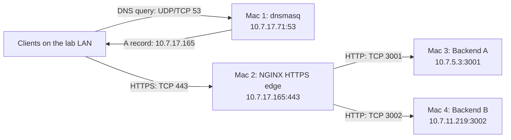
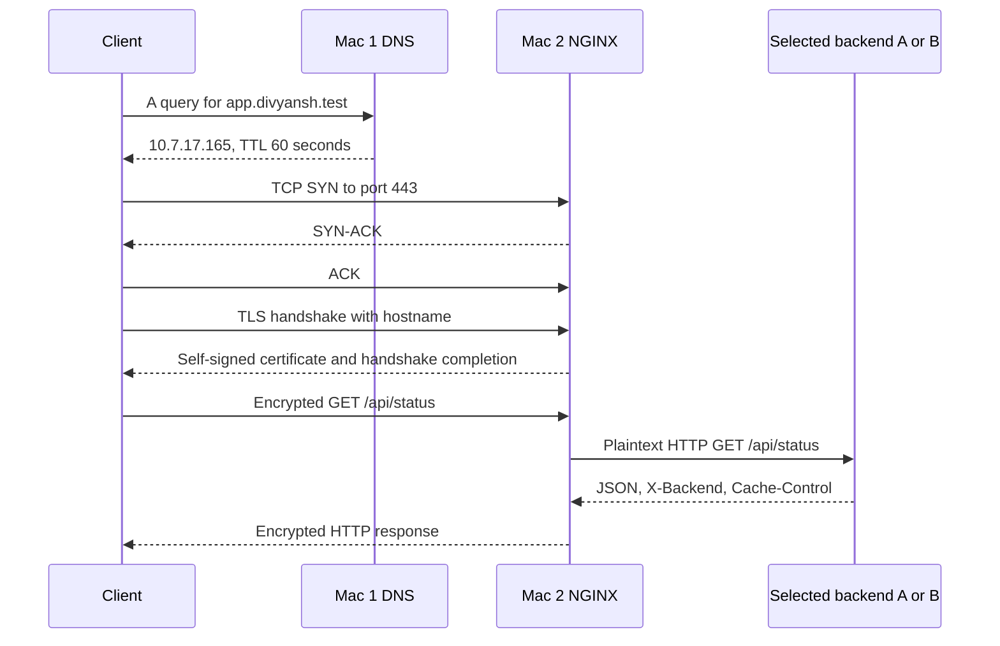

# CN Project Phase 1 — Architecture

## Purpose and scope

This lab connects four Macs into a private service: dnsmasq resolves lab hostnames, NGINX terminates HTTPS and balances requests, and two Python processes return JSON. It demonstrates DNS, TCP, TLS, HTTP, cache validation, and recovery from failures at different layers.

This document describes the checked-in implementation and recorded evidence. It does not claim that the services are currently running. Follow the [README](../README.md#run-the-lab) to reproduce the deployment.

## Topology and responsibilities

| Machine | Responsibility | Configuration or implementation |
| --- | --- | --- |
| Mac 1 | Private DNS; client DNS and failure checks | [dnsmasq-project.conf](../02_config/dnsmasq-project.conf) |
| Mac 2 | TLS termination, request forwarding, balancing, upstream failure handling, edge logs | [nginx.conf](../02_config/nginx.conf), [cert.cnf](../02_config/cert.cnf) |
| Mac 3 | Backend A, cache response, backend failure/recovery checks | [server.py](../03_backend_code/server.py), `BACKEND=A PORT=3001` |
| Mac 4 | Backend B, client checks, protocol capture | Same `server.py`, `BACKEND=B PORT=3002` |

Mac 1 and Mac 4 also act as clients in the evidence collection. Client requests still pass through Mac 2. Direct backend requests are diagnostic checks.

Addresses come from DNS and NGINX configuration. Mac 1's [network screenshot](../04_evidence/Mac1/Mac1-01-network.png) records a `/19` mask (`255.255.224.0`) and gateway `10.7.0.1`. All four configured addresses lie within `10.7.0.0/19`. Verify each machine's active interface, mask, route, and peer reachability when recreating the lab; membership in this address range alone does not prove connectivity.

## Request flow

DNS resolution may be skipped when the client has a cached answer. Established TCP/TLS connections may be reused. The sequence shows a fresh connection, not a mandatory handshake for every request.

`app.divyansh.test` and `api.divyansh.test` are aliases for the same NGINX server block. They do not select separate applications. NGINX forwards all paths through `location /` and preserves the incoming `Host` header.

## DNS design

[dnsmasq-project.conf](../02_config/dnsmasq-project.conf) listens on loopback and `10.7.17.71`, binds port 53, and serves the local `divyansh.test` zone. Two `host-record` entries return `10.7.17.165`, each with a 60-second TTL. Query logging goes to the foreground output.

`no-hosts` prevents answers sourced from the machine's hosts file. `no-resolv` prevents automatic use of system upstream resolvers. No upstream `server` is configured, so this instance is not a general Internet DNS resolver. A client can use a scoped resolver for the lab zone while retaining its usual resolver for other names.

DNS sends clients to the edge, not to individual backends. A DNS failure can prevent new hostname connections even while the edge and backends remain healthy. Cached answers can temporarily conceal a changed or broken DNS record.

## Edge, balancing, and availability

NGINX has one HTTPS listener on TCP 443 and an upstream group named `team_backends`. With no alternate balancing method configured, it uses default round-robin selection. Successful responses expose backend identity through the backend's `X-Backend` header and JSON payload.

| Setting | Checked-in value | Effect |
| --- | --- | --- |
| Backend A | `10.7.5.3:3001` | First upstream target |
| Backend B | `10.7.11.219:3002` | Second upstream target |
| Failure threshold | `max_fails=1` | One qualifying failure can temporarily exclude a backend |
| Failure interval | `fail_timeout=5s` | Failure accounting window and temporary exclusion interval |
| Connect timeout | `2s` | Bounds upstream connection establishment |
| Read timeout | `5s` | Timeout between successive upstream reads |
| Retry conditions | `error timeout http_502 http_503 http_504` | Eligible failures can try another upstream |
| Attempt limit | `proxy_next_upstream_tries 2` | At most two upstream attempts for an eligible request |

Failure detection is passive: live requests discover unhealthy targets. There is no periodic health-check service. After the failure interval, subsequent traffic can try a recovered backend. This interval is not a guarantee of recovery within exactly five seconds.

Retries are subject to NGINX's request/response rules; NGINX cannot transparently retry after it has started sending a response to the client. The implemented GET and HEAD endpoints have no write side effects.

When one backend is stopped, the other can continue serving requests. When both refuse connections, recorded logs show failures and `no live upstreams`, with HTTP 502 in the access log. Timeout scenarios can instead produce 504. DNS and the edge remain single points of failure.

The configuration does not enable an HTTP listener, HTTP-to-HTTPS redirection, HTTP/2, upstream TLS, proxy caching, or extra edge identity headers. It sets `Host` explicitly but does not configure `X-Forwarded-For`, `X-Real-IP`, or `X-Forwarded-Proto`. It does not explicitly set the upstream HTTP version. The backend supports HTTP/1.1, but the deployed NGINX version/defaults determine the proxy protocol unless configured separately.

Default access logging records client address, request, status, and related fields. It does not record upstream address or status explicitly. Use `X-Backend` to observe successful target selection and the error log to inspect failed upstream connections.

NGINX behavior references: [load balancing and passive health checks](https://nginx.org/en/docs/http/load_balancing.html), [upstream server parameters](https://nginx.org/en/docs/http/ngx_http_upstream_module.html), and [proxy retry rules](https://nginx.org/en/docs/http/ngx_http_proxy_module.html#proxy_next_upstream).

## Backend contract and caching

Both machines run the same standard-library Python implementation. `BACKEND` selects the response identity; `PORT` selects the listener. Defaults are A and 3001. `ThreadingHTTPServer` listens on `0.0.0.0`, making the service reachable through the machine's network interfaces. There is no persistent storage or external dependency.

The handler implements GET and HEAD. Route selection removes the query string, then matches `/`, `/api/status`, or `/cache`. Unknown paths return 404. Other methods have no application handler and receive the standard server's unsupported-method response.

For `/` and `/api/status`, the server returns backend identity and `status: ok` with `Cache-Control: no-store`. These endpoints make upstream selection visible on every successful request.

For `/cache`, both backends return identical JSON and ETag `"team-cache-v1"` with `Cache-Control: public, max-age=60`. An exact matching `If-None-Match` value produces 304 without a body. This allows a client to revalidate the same representation even when the next request reaches a different backend. `X-Backend` still identifies the responding process.

ETag handling is deliberately small: it compares the raw header to one fixed value. It does not implement wildcard, weak-validator, or multiple-tag matching. The example is a cache validation demonstration, not a complete HTTP cache implementation. NGINX does not store responses in this configuration.

## TLS and trust boundary

[cert.cnf](../02_config/cert.cnf) defines `CN=app.divyansh.test`, SANs for both lab names, `CA:FALSE`, and server authentication usage. [team-cert.pem](../02_config/team-cert.pem) has identical subject and issuer and is self-signed. It is not a leaf certificate issued by a separate team CA.

The checked-in certificate is valid from 2 October to 1 November 2026 (UTC). Clients must use a valid certificate matching the edge's private key. The README validates requests with `curl --cacert`, avoiding a requirement to install system-wide trust. Replacing the certificate requires distributing the new public certificate to clients.

`team-key.pem` is referenced by NGINX but excluded from version control. Its absence prevents a fresh checkout from starting the edge unchanged. Generate a matching certificate/key pair or provide the existing key securely. NGINX permits TLS 1.2 and TLS 1.3.

Encryption ends at Mac 2. The upstream HTTP hop is plaintext within the lab LAN. The backend sees Mac 2 as its TCP peer and cannot recover the original client IP through configured forwarding headers. Binding backends to all interfaces also permits direct LAN access where firewall rules allow it. There is no authentication or access-control configuration in the application.

## Failure demonstrations

| Layer | Injected failure | Observable result | Restore and verify |
| --- | --- | --- | --- |
| DNS resolver | Client uses a wrong DNS server | Lab name cannot resolve correctly | Restore Mac 1 resolver; check direct DNS and application lookup |
| DNS record | Lab name maps to a wrong address | Client attempts the wrong destination | Restore Mac 2 address; wait for or clear cached answers as needed |
| Backend availability | Stop A | Qualifying upstream failure followed by service from B | Restart A and confirm both identities return |
| Backend availability | Stop A and B | Edge accepts HTTPS but returns upstream errors | Restart both and confirm HTTP 200 |
| TCP destination | Request an unused edge port | Refusal/reset or timeout depending on network policy | Retry TCP 443 and confirm HTTPS succeeds |

Changing one condition at a time makes the failing layer identifiable. Capture failure and recovery separately. A wrong-port failure happens before an application response; a 502 occurs after the client reaches the edge successfully.

## Evidence map

| Behavior | Representative artifacts |
| --- | --- |
| Network and DNS | [Mac 1 DNS lookups](../04_evidence/Mac1/Mac1-04-dns-lookups.png), [Mac 4 DNS and resolver](../04_evidence/Mac4/Mac4-03-dns-and-resolver.png) |
| HTTPS and balancing | [Mac 2 HTTPS](../04_evidence/Mac2/Mac2-08-https.png), [Mac 2 balancing](../04_evidence/Mac2/Mac2-09-load-balancing.png), [Mac 4 HTTPS and balancing](../04_evidence/Mac4/Mac4-04-https-and-balancing.png) |
| Cache headers and 304 | [Mac 3 cache headers](../04_evidence/Mac3/Mac3-06-cache-headers.png), [Mac 3 304](../04_evidence/Mac3/Mac3-07-cache-304.png) |
| One backend failure/recovery | [Mac 2 A stopped](../04_evidence/Mac2/Mac2-12-backend-a-stopped.png), [Mac 2 A restored](../04_evidence/Mac2/Mac2-13-backend-a-restored.png) |
| Both backends unavailable | [Mac 2 both stopped](../04_evidence/Mac2/Mac2-14-both-backends-stopped.png), [access log](../04_evidence/Mac2/logs/access.log), [error log](../04_evidence/Mac2/logs/error.log) |
| DNS failure/recovery | [Mac 4 wrong resolver](../04_evidence/Mac4/Mac4-11-wrong-resolver-failure.png), [resolver recovery](../04_evidence/Mac4/Mac4-12-wrong-resolver-recovery.png), [wrong record](../04_evidence/Mac4/Mac4-13-wrong-dns-record-failure.png), [record recovery](../04_evidence/Mac4/Mac4-14-wrong-dns-record-recovery.png) |
| Wrong port and recovery | [Mac 4 wrong port](../04_evidence/Mac4/Mac4-19-wrong-port-failure.png), [correct port restored](../04_evidence/Mac4/Mac4-20-wrong-port-recovery.png) |
| Protocol flow | [DNS](../04_evidence/Mac4/Mac4-07-dns.png), [TCP handshake](../04_evidence/Mac4/Mac4-08-tcp-handshake.png), [TLS handshake](../04_evidence/Mac4/Mac4-09-tls-handshake.png), [encrypted data](../04_evidence/Mac4/Mac4-10-encrypted-data.png), [packet capture](../04_evidence/Mac4/Mac4-protocol-flow.pcap) |

The screenshot links identify artifacts by their recorded filenames. The saved NGINX logs contain successful status requests, `/cache` responses with 200 and 304, connection refusals, and `no live upstreams`. These are historical observations, not a current deployment health check.

A capture on Mac 4 can show its DNS and client-to-edge traffic. It does not necessarily show Mac 2-to-Mac 3 traffic on a switched LAN. HTTPS application content is encrypted unless TLS session secrets are available; encrypted packets alone do not reveal the JSON body.

## Operational constraints and design rationale

- A single DNS node gives clients stable names while backend addresses remain internal to the edge configuration.
- A single edge centralizes TLS and backend selection, while keeping the backend implementation small.
- One backend implementation avoids behavior drift; shared cache content makes cross-backend revalidation meaningful.
- Passive failure handling demonstrates continued service when a backend stops, with no separate monitoring process.
- Screenshots, logs, and a packet capture expose failures at DNS, transport, TLS, and application layers.

The tradeoffs are manual setup, machine-specific absolute paths, fixed upstream addresses, a short-lived self-signed certificate, and no redundancy for DNS or NGINX. No production hardening, database, service manager, automated deployment, or automated test suite is supplied. Before another run, update addresses and paths, provision the missing key, verify certificate validity, and collect fresh evidence.
